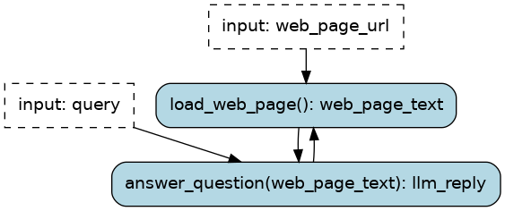
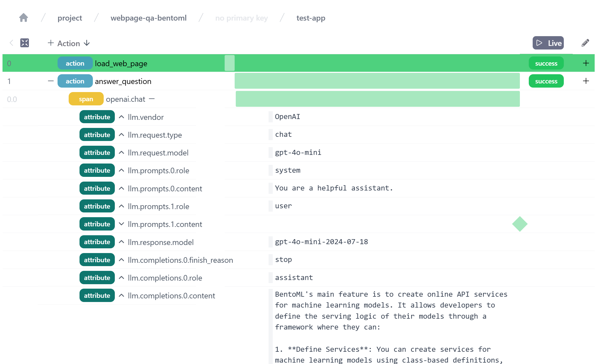
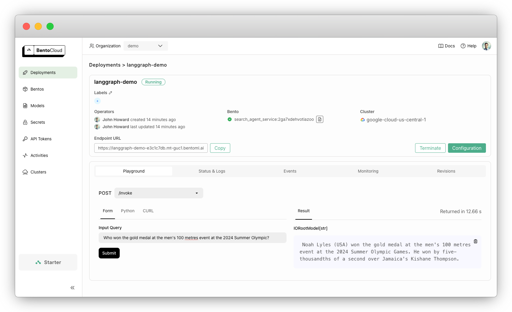

# Web page Question & Answer with Burr and BentoML

Deploy with BentoML a Burr `Application` that answers questions about a web page using an OpenAI LLM.



## Directory Content

- `application.py` uses Burr to define the application logic and implement actions
- `service.py` creates a BentoML service from the application
- `make_a_request.py` is a simple script to test the deployed service (local or BentoCloud)
- `bentofile.yaml` is a deployment configuration for the BentoML service
- `requirements.txt` contains the Python dependencies and is used by the BentoML config to create a container image. 


## Getting Started

Download the example directory

```sh
git clone https://github.com/bentoml/BentoBurr.git
cd BentoBurr/pdf_question_answer
``` 

### Run locally

Install dependencies

```sh
pip install -r requirements.txt
```

Serve the application (replace `$YOUR_KEY` with your OpenAI API key)

```sh
OPENAI_API_KEY=$YOUR_KEY bentoml serve .
```

Run the `make_a_request.py` script to try the service

```sh
python make_a_request.py --query "What's BentoML main feature?" --web_page_url "https://docs.bentoml.com/en/latest/build-with-bentoml/services.html"
```

#### Synchronous API

Generate a client and call the `.run()` method, which corresponds to the one defined in `WebPageQAService` in `service.py`

```python
import bentoml

with bentoml.SyncHTTPClient("http://localhost:3000") as client:
    response = client.run(
        web_page_url="https://docs.bentoml.com/en/latest/build-with-bentoml/services.html",
        query="What's BentoML main feature?",
    )
```

#### Asynchronous API

Generate a client and call the `.run.submit()` method. This will start an async task.

```python
import bentoml

client = bentoml.SyncHTTPClient("http://localhost:3000")
task = client.run.submit(
    web_page_url="https://docs.bentoml.com/en/latest/build-with-bentoml/services.html",
    query="What's BentoML main feature?",
)
```

Then, you can query the status of the task until it's equal to `"success"`

```python
# wait until task is completed; check status every 5 second
while task.get_status().value == "in_progress":
    print("Waiting for task to complete...")
    time.sleep(5)

# handle completed task
if task.get_status().value == "success":
    print("Result: ", task.get())
else:
    print("Task failed")
```

### Inspect results

Launch the Burr UI locally to view the tracked execution. Then, navigate to http://localhost:7423 (default)

```sh
burr
```

From a notebook or Google Colab environment, you can do

```python
%load_ext burr.integrations.notebook

%burr_ui
```



## Deploy to BentoCloud



Login to BentoCloud

```sh
pip install bentoml
bentoml cloud login
```

Create a secret

```sh
bentoml secret create openai OPENAI_API_KEY=$OPENAI_API_KEY
```

Deploy the service

```sh
bentoml deploy . --name web_page_qa --secret openai
```

Make a request

```sh
DEPLOYED_ENDPOINT=$(bentoml deployment get web_page_qa -o json | jq -r ".endpoint_urls[0]")
python make_a_request.py --service_url $DEPLOYED_ENDPOINT --query "What's BentoML?" --web_page_url "https://docs.bentoml.com/en/latest/build-with-bentoml/services.html"
``` 

## Deploy Burr UI

When deploying your Burr `Application`, you need to setup a destination for telemetry and persistence. See [this guide](https://github.com/DAGWorks-Inc/burr/tree/main/burr/tracking/server/s3) for an S3-backed Burr server.
